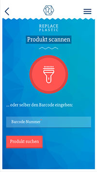
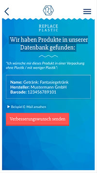
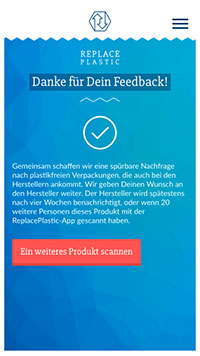

# "ReplacePlastic": a mobile app by "Küste gegen Plastik" - an environmental protection association

## About
With the help of this app we want to tell manufacturers that we like them to change their packaging. So they start caring about environment friendly packaging when designing products and support the development biodegradable materials. Users can scan barcodes of products which they think are packed with too much plastic and report them to us. The entries are then collected and the products manufacturers are contacted via mail.

### Screenshots
[](./store/screenshots/01_scan.png)
[](./store/screenshots/02_product.png)
[](./store/screenshots/03_submitted.png)

## Installing

### Prequisites
The app is a Hyrid JavaScript app based on [VueJS](https://vuejs.org/) and [Apache Cordova](https://cordova.apache.org/). The Build-Process uses [NodeJS](https://nodejs.org/en/). You can run the browser part on any OS. If you're trying to build the native iOS app Apple (sadly) forces you to use a MAC running a current version of OSX for this.

#### Required Software
- [NodeJS](https://nodejs.org/en/) (> 7)
- [Apache Cordova](https://cordova.apache.org/)
- [Android Studio](https://developer.android.com/studio/index.html)
- [XCode](https://developer.apple.com/xcode/)
- [Gradle](https://gradle.org/)

### Installation
- Setup and start the backend API following the instructions in it's repo: https://github.com/Kueste-gegen-Plastik/replace-plastic-api
- Clone the repo: `git clone https://github.com/Kueste-gegen-Plastik/replace-plastic-app.git`
- Install dependencies: `cd replace-plastic-app && npm install`
- Install XCode and Android Studio
- Install gradle (`brew install gradle` using Homebrew)
- copy `src/config/env.example.js` to `src/config/env.development.js` and adjust the settings for the backend API. If you didn't change the port for the backend (defaults to `8888`) everything should be fine and ready to go.
- execute `cordova platform add ios && cordova platform add android` to generate the cordova project structure for the respective operating systems

### Running the application (development)
To start the development process run `npm run dev` in the projects root folder. This will spawn a webpack dev-server on port 8080. Open your favorite browser on [http://localhost:8080](http://localhost:8080) and start developing. As soon as you save one of the files or add / remove something the app will be reloaded and compiled automatically.

### Building binarys for iOS and Android
There are two npm tasks to prepare the build for android and ios: `npm run build-android` and `npm run build-ios`. Executing each of them will do a static build (html, css, js, assets) of the project and run a cordova task that bootstraps the structure for handling the project in Xcode or Android Studio. When the process finishes you can open `platforms/ios` in XCode or `platforms/android` in Android studio.
For a detailed guide how to continue from there please see: https://cordova.apache.org/docs/de/latest/guide/platforms/


## Project structure
```
build --> Webpack related files for building the application
│
config --> Config settings for webpack
│
hooks --> Cordova hooks
│
resources --> Assets for building icons & splashcreens for the app
│
src --> The apps source files
│
└───api --> Backend / API related stuff
│
└───components --> Vue components
│   │
│   └───shared --> View independent components (header, footer...)
│   │
│   └───views --> container components for "views/pages"
│
└───config --> Config settings for the actual app (backend urls, passwords...)
│
└───router --> routes setup
│
└───store --> vuex related stuff
│
store --> generated resources (splash/icons) for the app
```
